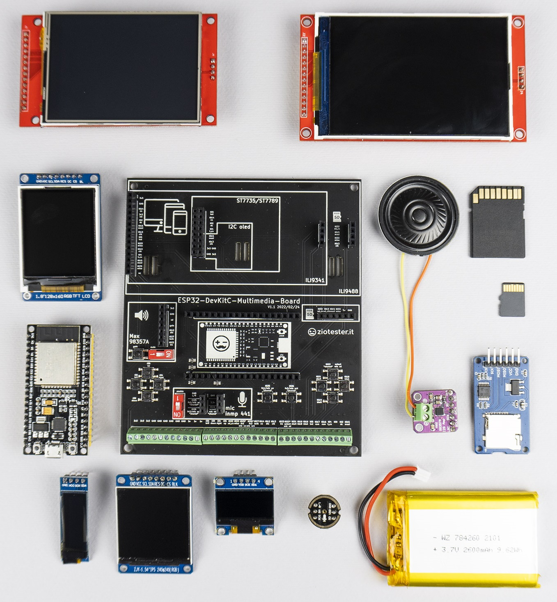

# ESP32-MMB-LVGL

Example projects for **ESP32-DevKitC-Multimedia-Board**  and **LVGL** by **ZioTester Lab**.

Info, guides, tutorials and documentation: [HERE](http://ziotester.github.io/hardware/mmb)

